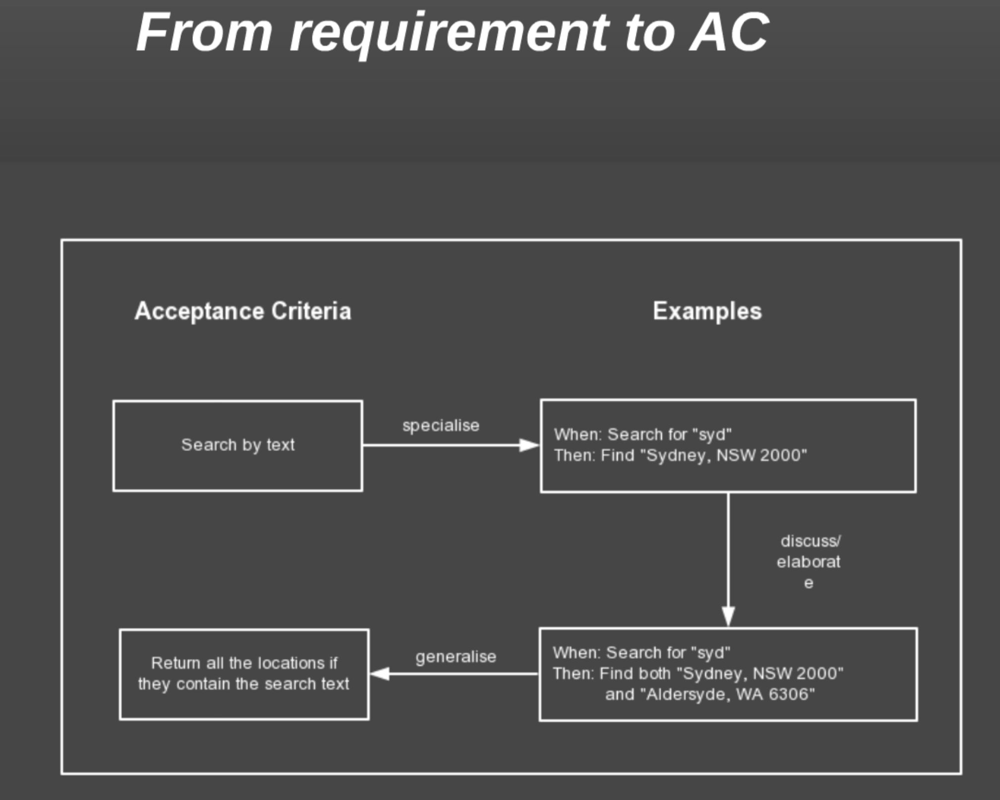

# BDD 

- WorkFlow 

- From Requirement to AC(Accept Criteria)

- BDD Keywords
    * Feature
    * Step
    * Steps
- BDD keywords to XMIND Testing Coverage
- BDD Keywords to Requirement

## Implementation

- JAVA BDD Framework
- Python BDD Framework 
- Alternative Way/Simple Way
- POC

## Pain Points

- Time consuming
- Slow Feedback
- Dependency Test Case/Long steps test scenario
- Unstable environment/result
- Remote Service Call
- Maintenance Cost

## Thinking

- Decoupling: Micro Service
- Single Service Test: tests on different layers
- Integration Test: E-2-E/Contract
- Strategy: Running/Composing/Results checking/Test Data Preparing

## Tooling

- moco
- E-2-E Testing
- Running in Parallel
