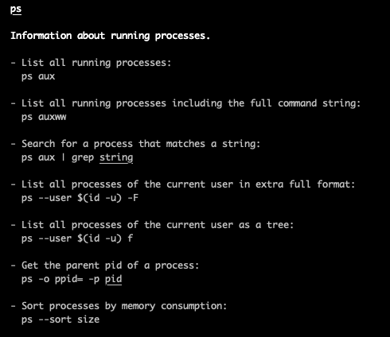
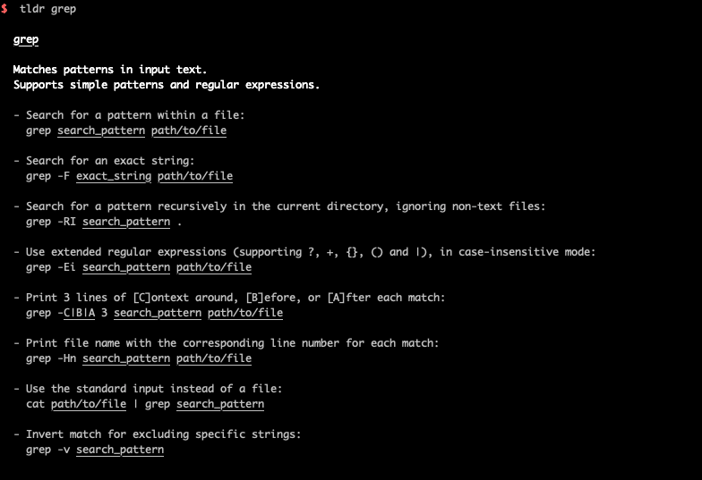

# 测试学linux命令和shell

---

## 测试为什么学习linux命令和shell？

- 常用的服务器都是Linux，没有GUI界面，只能使用命令
- 日常获取日志错误，部署服务，等等都需要linux命令
- 使用shell可以结合linux命令，自动化操作
- 日常可能使用上传下载文件到远程服务器
- .......
---

## 如何linux命令查看帮助

- 使用帮助命令```man```
```sh
man tail
```
- ```tldr``` 这个工具的帮助会精炼很多
```sh
npm install tldr -g
```
---

## 如何查看日志

- 不停的监控日志
```sh
tail -f log.log
tail -f -n 1000 application.log
```
- 从日志中查找错误

```sh
grep exception log.log
```
- 一直不停的监控出错的日志
```sh
tail -f log.log | grep exception
```
---
## 如何查看JAVA进程是否存在

```sh
ps aux | grep java
```

```ps``` 帮助 


---
## 如何杀死一个进程

```sh
ps aux | grep java | grep -v grep | xargs kill -9
```
tips: ```grep -v``` 是什么？ 好好看看那grep命令哦

---

## grep 简单说明



--- 

## ```|```是什么？

```|```管道符号：上一个命令的返回是下一个命令的输入

---

## ```find``` 如何查找文件

```sh
find . -name *.py 
```

tips: 想查查find 的其他用法要怎么办？

---

## 一些有用的命令 -1

- ```xargs```: shell scripts
```sh
ps aux | grep java | grep -v 'grep' | xargs kill -9
```
- ```netstat```:  the network status,获取使用占用8080端口的程序
```sh
netstat -antlp | grep 8080
```

---

## 一些有用的命令 -2

- tee: write to new std output and a file

```sh
man tee | tee man_tee.txt
```

- systemctl: runing/stop/restart service

```sh
systemctl nginx status
```

---- 

## 还有很多很多，有空再说

- tar
- head
- sort
- uniq
- tr
- rsync
- df/du
- free

--- 

## 还有很多很多，有空再说

- vmstat
- iostat
- top/htop
- sar

---
## 还有很多很多，有空再说
- awk
- sed
- crontab

## awk 最简单的用法

如何把进程名字包含有python的进程号打印出来

```sh
ps aux | grep python | grep -v grep | awk {'print $2'}
```


--- 

## sed 最简单的用法

- 在testfile文件的第四行后添加一行，并将结果输出到标准输出，在命令行提示符下输入如下命令：

```sh
sed -e 4a\newLine testfile 
```
- 删除文件中的2-5行

```sh
nl /etc/passwd | sed '2,5d'
```

--- 

### Linux中的文件编辑vim常用方法

|Key|direction|
|---|---------|
|k|up|
|j|down|
|h|left|
|i|right|
|10k|up to 10 lines|
|5h|move right 5 words

---

### Vim 光标移动快捷方式

|Key|direction|
|---|---------|
|0|jump to beginnign of a line|
|^|first word of a line|
|$|end of a line|
|g_|last word of a line|
---

### vim 更多
|Key|direction|
|---|---------|
|Ctrl+f|screen forward|
|Ctrl+b|screen backward|
|Ctrl+d|half screen forward|
|Ctrl+u|half screen backward|
|N%|N% of file|
|NG|GO to N Line|
|gg|head of a file|
|G|end of a file|

--- 
## Vim Cheatsheet-Paragraph and Search

|Key|direction|
|---|---------|
|{|head of paragraph|
|}|end of a big word|
|/text|search after the cursor|
|?text|search before the cursor|

---
## Vim 复制和删除
|Key|direction|
|---|---------|
|yy|复制一行|
|p|粘贴|
|dd|删除一行|
|10dd|?猜猜干什么的|
|dw|?猜猜干什么的？|
|d$|?猜猜干什么的？|

---
## Vim 替换

vim和sed结合
- [sed](https://www.runoob.com/linux/linux-comm-sed.html)